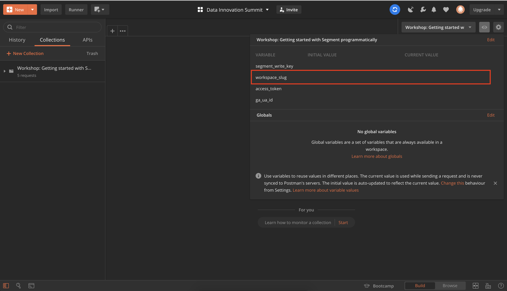
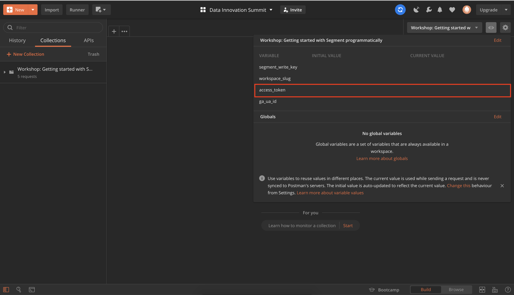
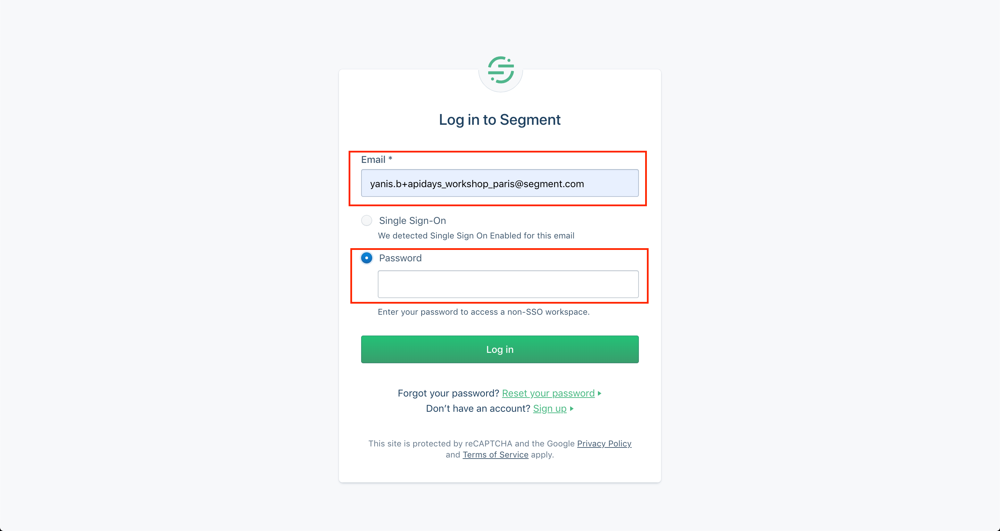
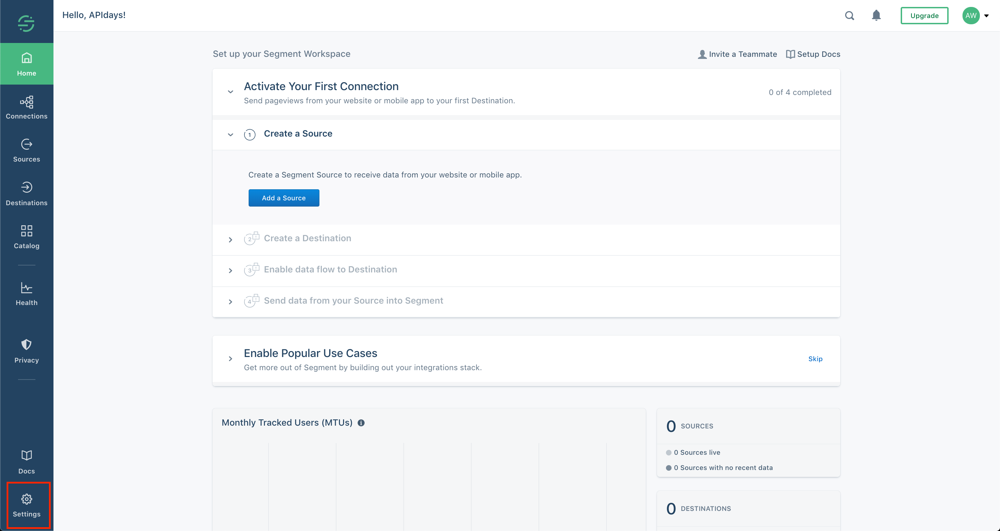
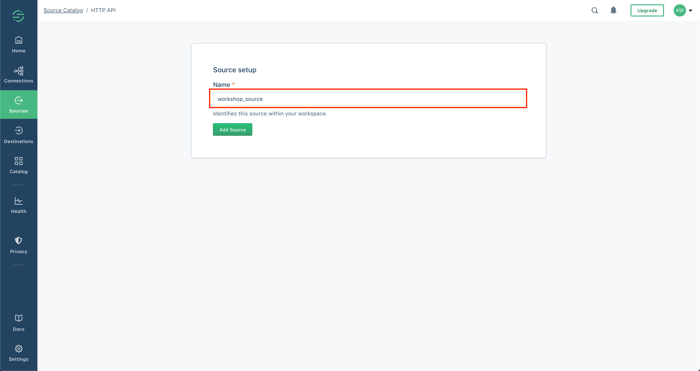

# Ingesting data via HTTP and verifying your data
Segment provides various collection technologies icluding a JavsScript library, mobile SDKs and server-side libraries. During this exercise we will demonstrate collection/ingestion mechanisms as by means of POST requests to our HTTP API.

## Part 1 - Set up Your Request environment
Requests can be made by various means. In this exercise we propose using Postman or send the requests via cURL. Feel free to use your mechanism of choice, keeping in mind that the request code might need slight adjustments.

### Configuring Postman
1. Download [Postman](https://www.getpostman.com/downloads/) 
2. Clone this repo for the Postman [environment](postman_info/postman_environment.json) & [request collection](postman_info/postman_collection.json).
2. Import the Postman environment.


3. Add your write key to the environment variable.


4. Add your workspace slug to the environment variable.



#### In preparation of [exercise 3](exercise3.md/) we'll also add our access token.
5. Create your access token in Segment's access management console.

6. Add your write key to the environment variable.



### Prepare cURL requests
1. Find your workshop source's write key.

2. Base64encode the write key. You can do so at [Base64encode.org](https://www.base64encode.org/).
3. In [ingest_data.json](curl_info/ingest_data.json) replace instances of {{write_key}} with your base64 encoded value.
4. Find your workspace slug.

5. In [ingest_data.json](curl_info/ingest_data.json) replace instances of {{workspace_slug}} with the workspace slug of your claimed workpace.


3. Claim your shiny new Segment workspace by putting your name in the appropriate fields, please.

## Part 1 - Set up Your Segment Workspace
After you have claimed your workspace, there are a couple of steps you need to follow to get it ready to start the workshop.
1. Go to [https://app.segment.com](https://app.segment.com/).
2. Make sure you select the “Password” login radio button.
3. Log in as:
```
username: yanis.b+apidays_workshop_paris@segment.com
password: <will be on the whiteboard>
```

4. Click the “Log In” button.
5. Find the workspace name you claimed in the spreadsheet.
6. Click the tile with the name you claimed.

7. Click on the Settings gear in the bottom left corner of the screen that appears.

8. Change the name of the workspace to something you will remember, so that you can find your workspace more easily in case you have to log back in during or after the workshop. 
9. Click the “Save Changes” button.


## Part 2 - Create Segment Source
Segment Sources allow you to collect semantic events as your users interact with your web sites, mobile applications, or server-side applications.  For this workshop, you will set up an HTTP source
Your initial Segment workspace will look like this:


You will need to add four sources, using the ‘Add Source’ button in the screen shot above.  To set up a source:


Please enter "workshop_source" as the source name. It'll be used as part of the request URLs we will be making in exercise 2.


Once your source is configured, it will appear in your workspace like this:


