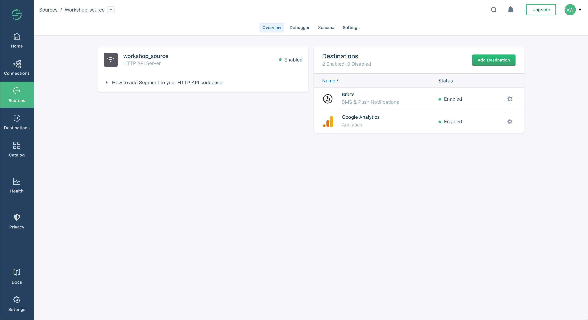

# Configuring a downstream data consumer programmatically
Now that we have a decoupled data collection the next step to make real use of Segment's service-nature. During the next steps, you will connect both Google Analaytics and Braze to your source. For this we will be using Segment's [Config API](https://reference.segmentapis.com/?version=latest#intro). The Config API is a set of REST APIs that enable you to programmatically manage Segment and by providing mechanisms that abstract API integrations in service-like fashion. 

[Google Analytics](https://analytics.google.com/analytics/web/) is a web analytics service offered by Google that tracks and reports website traffic, currently as a platform inside the Google Marketing Platform brand. It also is Segment's most enabled destination.

## Connecting destinations with Postman
1. Find the "Destination configuration" folder in the request collection
2. Select the "Configure Google Analytics" request & send it.

## Connecting destinations with cURL
1. Find [configure_destinations.md](curl_info/onfigure_destinations.md/) in the curl_info folde
2. Copy the "Configure Google Analytics" request from [configure_destinations.md](curl_info/configure_destinations.md/).
3. Paste the request into your command line and execute the cURL request.

## Success!
If your destination overview looks something like this, then you have successfully ingested your first customer data points and connected them to a downstream data consumer without ever touching any native APIs.

# [Let's wrap things up](https://docs.google.com/presentation/d/1CTK66nBmpJUCjdVKm0eCWEu43pgg7Yoe8rA-bblzVFM/edit?usp=sharing)