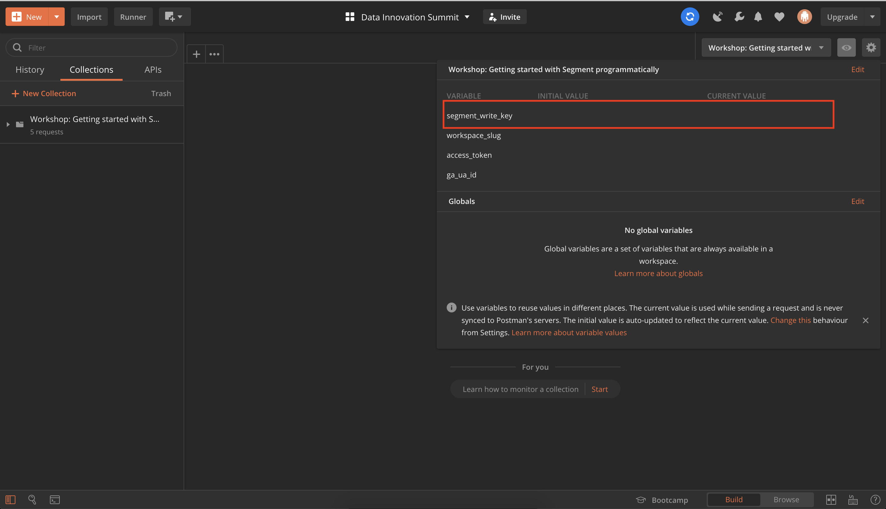
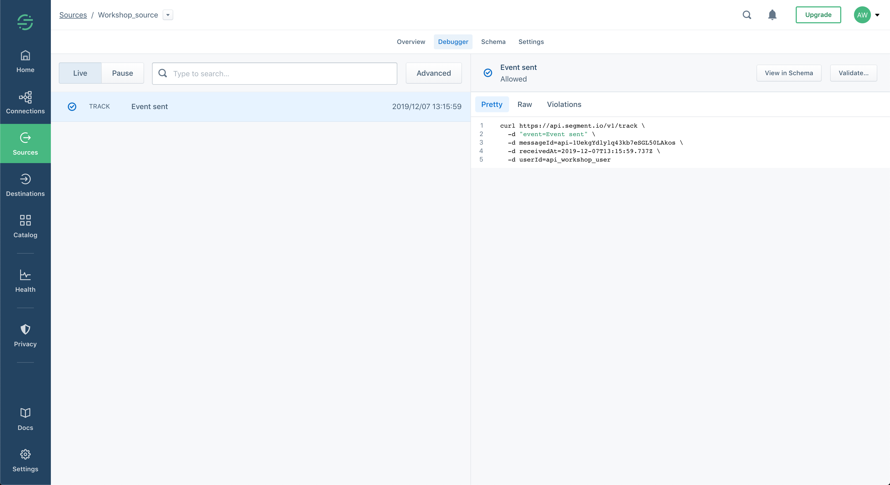

# Ingesting data via HTTP and verifying your data
Segment provides various collection technologies including a JavsScript library, mobile SDKs and server-side libraries. During this exercise we will demonstrate collection/ingestion mechanisms as by means of POST requests to our HTTP API.

## Part 1 - Set up Your Request environment
Requests can be made by various means. In this exercise we propose using Postman or send the requests via cURL. Feel free to use your mechanism of choice, keeping in mind that the request code might need slight adjustments.

### Configuring Postman
1. Download [Postman](https://www.getpostman.com/downloads/) 
2. Clone this repo for the Postman [environment](postman_info/postman_environment.json) & [request collection](postman_info/postman_collection.json).
3. Import the Postman environment by drag-and-dropping the JSON file.

4. Add your write key to the environment variable.

5. Add your workspace slug to the environment variable.

__In preparation of [exercise 3](exercise3.md/) we'll also add our access token.__
6. Create your access token in Segment's access management console.

7. Add your access token to the environment variable.

6. Import the Postman request collection by drag-and-dropping the JSON file.

### Prepare cURL requests
1. Find your workshop source's write key.

2. Base64encode the write key. You can do so at [Base64encode.org](https://www.base64encode.org/).
3. In [ingest_data.json](curl_info/ingest_data.json) replace instances of {{write_key}} with your base64 encoded value.
4. Find your workspace slug.

5. In [ingest_data.json](curl_info/ingest_data.json) replace instances of {{workspace_slug}} with the workspace slug of your claimed workpace.
6. In [configure_destinations.md](curl_info/configure_destinations.md) replace instances of {{workspace_slug}} with the workspace slug of your claimed workpace.
__In preparation of [exercise 3](exercise3.md/) we'll also configure our access token.__
7. Find your access token.

8. In [configure_destinations.md](curl_info/configure_destinations.md) replace instances of {{access_token}} with your base64 encoded value.

## Part 2 - Ingest data

### Using Postman
The request collection includes four different request types. At it's core Segment tries to answer the following questions with three of the four calls:

- [Identify](https://segment.com/docs/connections/spec/identify/): who is the customer?
- [Track](https://segment.com/docs/connections/spec/track/): what are they doing?
- [Page](https://segment.com/docs/connections/spec/page/): what web page are they on?

Additionally to these, the collection includes a [batch call](https://segment.com/docs/connections/sources/catalog/libraries/server/http-api/#batch), that includes a mixture of identify, track & page calls. 

1. Select one of the events listed in the event collection and send the request. Feel free to send these requests as you see fit. If you'd like to adjust the payload please refer to our [docs](https://segment.com/docs/connections/sources/catalog/libraries/server/http-api/).
2. Navigate to your source's debugger to see data flowing through in real-time.

### Using cURL
1. Find your configured data ingestion event in [ingest_data.json](curl_info/ingest_data.json).
2. Copy paste them into your command line and execute the code.
3. Navigate to your source's debugger to see data flowing through in real-time.

## Success!
If your debugger looks something like this, then you have successfully ingested your first customer data points.
